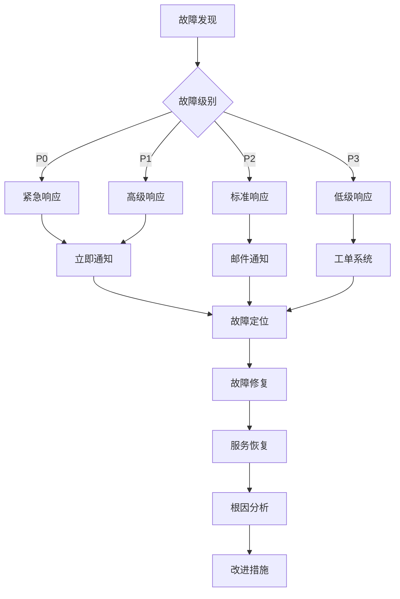

# AI Hub 平台运维指南

## 目录

1. [运维概述](#运维概述)
2. [日常监控](#日常监控)
3. [性能优化](#性能优化)
4. [故障处理](#故障处理)
5. [安全管理](#安全管理)
6. [容量规划](#容量规划)
7. [灾难恢复](#灾难恢复)
8. [自动化运维](#自动化运维)

## 运维概述

AI Hub 平台的运维工作涵盖了系统监控、性能优化、故障处理、安全管理等多个方面。本指南提供了完整的运维流程和最佳实践。

### 运维目标

- **可用性**: 确保 99.9% 的服务可用性
- **性能**: 响应时间控制在 2 秒以内
- **安全性**: 零安全漏洞事件
- **成本效益**: 优化资源使用，控制运营成本

### 运维团队职责

| 角色 | 职责 |
|------|------|
| 系统管理员 | 服务器维护、系统更新、备份管理 |
| 数据库管理员 | 数据库优化、备份恢复、性能调优 |
| 网络工程师 | 网络配置、负载均衡、安全防护 |
| 应用运维 | 应用部署、监控告警、故障处理 |
| 安全工程师 | 安全审计、漏洞修复、安全策略 |

## 日常监控

### 系统监控指标

#### 核心指标

1. **可用性指标**
   - 服务可用率: 99.9%
   - 响应时间: P95 < 2s, P99 < 5s
   - 错误率: < 0.1%

2. **性能指标**
   - CPU 使用率: < 80%
   - 内存使用率: < 85%
   - 磁盘使用率: < 90%
   - 网络带宽: < 80%

3. **业务指标**
   - API 请求数/分钟
   - 活跃用户数
   - Token 使用量
   - 成功率

### 监控工具配置

#### Prometheus + Grafana

```yaml
# prometheus 告警规则
groups:
- name: aihub.rules
  rules:
  # 服务可用性告警
  - alert: ServiceDown
    expr: up == 0
    for: 1m
    labels:
      severity: critical
    annotations:
      summary: "服务 {{ $labels.instance }} 不可用"
      description: "服务 {{ $labels.instance }} 已停止响应超过 1 分钟"

  # 高错误率告警
  - alert: HighErrorRate
    expr: rate(http_requests_total{status=~"5.."}[5m]) / rate(http_requests_total[5m]) > 0.01
    for: 2m
    labels:
      severity: warning
    annotations:
      summary: "错误率过高"
      description: "错误率已达到 {{ $value | humanizePercentage }}"

  # 响应时间告警
  - alert: HighResponseTime
    expr: histogram_quantile(0.95, rate(http_request_duration_seconds_bucket[5m])) > 2
    for: 5m
    labels:
      severity: warning
    annotations:
      summary: "响应时间过长"
      description: "95% 的请求响应时间超过 2 秒"

  # 资源使用告警
  - alert: HighCPUUsage
    expr: 100 - (avg by(instance) (rate(node_cpu_seconds_total{mode="idle"}[5m])) * 100) > 80
    for: 10m
    labels:
      severity: warning
    annotations:
      summary: "CPU 使用率过高"
      description: "{{ $labels.instance }} CPU 使用率 {{ $value }}%"

  - alert: HighMemoryUsage
    expr: (1 - (node_memory_MemAvailable_bytes / node_memory_MemTotal_bytes)) * 100 > 85
    for: 5m
    labels:
      severity: warning
    annotations:
      summary: "内存使用率过高"
      description: "{{ $labels.instance }} 内存使用率 {{ $value }}%"

  - alert: HighDiskUsage
    expr: (1 - (node_filesystem_avail_bytes / node_filesystem_size_bytes)) * 100 > 90
    for: 5m
    labels:
      severity: critical
    annotations:
      summary: "磁盘使用率过高"
      description: "{{ $labels.instance }} 磁盘 {{ $labels.mountpoint }} 使用率 {{ $value }}%"
```

#### Grafana 仪表板配置

```json
{
  "dashboard": {
    "id": null,
    "title": "AI Hub 运维总览",
    "tags": ["aihub", "production"],
    "timezone": "browser",
    "panels": [
      {
        "id": 1,
        "title": "服务可用性",
        "type": "stat",
        "targets": [
          {
            "expr": "up{job=\"aihub-backend\"}",
            "legendFormat": "{{instance}}"
          }
        ],
        "fieldConfig": {
          "defaults": {
            "mappings": [
              {
                "value": "0",
                "text": "不可用",
                "color": "red"
              },
              {
                "value": "1",
                "text": "可用",
                "color": "green"
              }
            ]
          }
        }
      },
      {
        "id": 2,
        "title": "请求率",
        "type": "graph",
        "targets": [
          {
            "expr": "rate(http_requests_total[5m])",
            "legendFormat": "{{method}} {{endpoint}}"
          }
        ]
      },
      {
        "id": 3,
        "title": "响应时间分布",
        "type": "graph",
        "targets": [
          {
            "expr": "histogram_quantile(0.50, rate(http_request_duration_seconds_bucket[5m]))",
            "legendFormat": "50th percentile"
          },
          {
            "expr": "histogram_quantile(0.95, rate(http_request_duration_seconds_bucket[5m]))",
            "legendFormat": "95th percentile"
          },
          {
            "expr": "histogram_quantile(0.99, rate(http_request_duration_seconds_bucket[5m]))",
            "legendFormat": "99th percentile"
          }
        ]
      },
      {
        "id": 4,
        "title": "错误率",
        "type": "graph",
        "targets": [
          {
            "expr": "rate(http_requests_total{status=~\"4..\"}[5m]) / rate(http_requests_total[5m])",
            "legendFormat": "4xx 错误"
          },
          {
            "expr": "rate(http_requests_total{status=~\"5..\"}[5m]) / rate(http_requests_total[5m])",
            "legendFormat": "5xx 错误"
          }
        ]
      },
      {
        "id": 5,
        "title": "系统资源",
        "type": "graph",
        "targets": [
          {
            "expr": "100 - (avg by(instance) (rate(node_cpu_seconds_total{mode=\"idle\"}[5m])) * 100)",
            "legendFormat": "CPU 使用率"
          },
          {
            "expr": "(1 - (node_memory_MemAvailable_bytes / node_memory_MemTotal_bytes)) * 100",
            "legendFormat": "内存使用率"
          }
        ]
      }
    ],
    "time": {
      "from": "now-1h",
      "to": "now"
    },
    "refresh": "30s"
  }
}
```

### 日志监控

#### ELK Stack 配置

```yaml
# logstash.conf
input {
  beats {
    port => 5044
  }
}

filter {
  if [fields][service] == "aihub-backend" {
    json {
      source => "message"
    }

    date {
      match => [ "timestamp", "ISO8601" ]
    }

    if [level] == "ERROR" {
      mutate {
        add_tag => [ "error" ]
      }
    }
  }
}

output {
  elasticsearch {
    hosts => ["elasticsearch:9200"]
    index => "aihub-logs-%{+YYYY.MM.dd}"
  }

  if "error" in [tags] {
    email {
      to => "ops-team@aihub.com"
      subject => "AI Hub 错误告警"
      body => "发现错误日志: %{message}"
    }
  }
}
```

#### 日志分析脚本

```bash
#!/bin/bash
# log_analyzer.sh

LOG_DIR="/var/log/aihub"
ERROR_THRESHOLD=10
REPORT_EMAIL="ops-team@aihub.com"

# 分析错误日志
error_count=$(grep -c "ERROR" $LOG_DIR/backend.log | head -1)
if [ $error_count -gt $ERROR_THRESHOLD ]; then
    echo "告警: 过去 1 小时内发现 $error_count 个错误" | \
    mail -s "AI Hub 错误日志告警" $REPORT_EMAIL
fi

# 分析访问日志
# 统计 API 调用次数
echo "API 调用统计 (过去 1 小时):"
awk 'BEGIN{count=0} $1 > "'$(date -d '1 hour ago' '+%d/%b/%Y:%H')'" {count++} END{print "总请求数: " count}' $LOG_DIR/access.log

# 统计响应时间
echo "平均响应时间:"
awk '$1 > "'$(date -d '1 hour ago' '+%d/%b/%Y:%H')'" {sum+=$NF; count++} END{print sum/count "s"}' $LOG_DIR/access.log

# 检测异常 IP
echo "异常 IP 访问 (超过 1000 次/小时):"
awk '$1 > "'$(date -d '1 hour ago' '+%d/%b/%Y:%H')'" {ips[$1]++} END{for(ip in ips) if(ips[ip] > 1000) print ip, ips[ip]}' $LOG_DIR/access.log
```

### 监控脚本

```bash
#!/bin/bash
# daily_monitor.sh

REPORT_FILE="/tmp/daily_report_$(date +%Y%m%d).txt"
API_URL="https://api.aihub.com/api/v1/health"

echo "AI Hub 平台日常监控报告 - $(date)" > $REPORT_FILE
echo "======================================" >> $REPORT_FILE

# 服务状态检查
echo "1. 服务状态检查" >> $REPORT_FILE
services=("aihub-backend" "aihub-frontend" "postgres" "redis" "nginx")
for service in "${services[@]}"; do
    if docker-compose -f docker-compose.prod.yml ps $service | grep -q "Up"; then
        echo "✅ $service: 运行正常" >> $REPORT_FILE
    else
        echo "❌ $service: 服务异常" >> $REPORT_FILE
    fi
done

# API 健康检查
echo -e "\n2. API 健康检查" >> $REPORT_FILE
api_status=$(curl -s -o /dev/null -w "%{http_code}" $API_URL)
if [ $api_status -eq 200 ]; then
    echo "✅ API 服务: 正常" >> $REPORT_FILE
else
    echo "❌ API 服务: 异常 (HTTP $api_status)" >> $REPORT_FILE
fi

# 资源使用情况
echo -e "\n3. 资源使用情况" >> $REPORT_FILE
cpu_usage=$(top -bn1 | grep "Cpu(s)" | awk '{print $2}' | awk -F'%' '{print $1}')
memory_usage=$(free | grep Mem | awk '{printf("%.1f"), $3/$2 * 100.0}')
disk_usage=$(df -h / | awk 'NR==2 {print $5}')

echo "CPU 使用率: $cpu_usage%" >> $REPORT_FILE
echo "内存使用率: $memory_usage%" >> $REPORT_FILE
echo "磁盘使用率: $disk_usage" >> $REPORT_FILE

# 数据库状态
echo -e "\n4. 数据库状态" >> $REPORT_FILE
db_connections=$(docker-compose -f docker-compose.prod.yml exec -T postgres psql -U aihub_user -d aihub_prod -t -c "SELECT count(*) FROM pg_stat_activity;")
db_size=$(docker-compose -f docker-compose.prod.yml exec -T postgres psql -U aihub_user -d aihub_prod -t -c "SELECT pg_size_pretty(pg_database_size('aihub_prod'));")

echo "活跃连接数: $db_connections" >> $REPORT_FILE
echo "数据库大小: $db_size" >> $REPORT_FILE

# 发送报告
cat $REPORT_FILE | mail -s "AI Hub 日常监控报告" ops-team@aihub.com
```

## 性能优化

### 数据库优化

#### PostgreSQL 性能调优

```sql
-- 性能优化配置
-- postgresql.conf

# 内存配置
shared_buffers = 256MB                    -- 25% of RAM
effective_cache_size = 1GB                -- 75% of RAM
work_mem = 4MB                            -- Per connection
maintenance_work_mem = 64MB

# 检查点配置
checkpoint_completion_target = 0.9
wal_buffers = 16MB
min_wal_size = 1GB
max_wal_size = 4GB

# 查询优化
random_page_cost = 1.1                    -- SSD 优化
effective_io_concurrency = 200           -- SSD 并发
default_statistics_target = 100           -- 统计信息精度

# 连接配置
max_connections = 200
shared_preload_libraries = 'pg_stat_statements'

-- 创建索引优化查询
CREATE INDEX CONCURRENTLY idx_sessions_created_at ON sessions(created_at);
CREATE INDEX CONCURRENTLY idx_usage_records_date ON usage_records(date);
CREATE INDEX CONCURRENTLY idx_api_keys_created_by ON api_keys(created_by);

-- 分析表统计信息
ANALYZE sessions;
ANALYZE usage_records;
ANALYZE api_keys;

-- 查看慢查询
SELECT query, mean_time, calls, total_time
FROM pg_stat_statements
ORDER BY mean_time DESC
LIMIT 10;
```

#### Redis 优化配置

```conf
# redis.conf 优化配置

# 内存配置
maxmemory 512mb
maxmemory-policy allkeys-lru

# 持久化配置
save 900 1
save 300 10
save 60 10000
appendonly yes
appendfsync everysec

# 网络配置
tcp-keepalive 300
timeout 0

# 客户端配置
maxclients 10000

# 慢日志配置
slowlog-log-slower-than 10000
slowlog-max-len 128
```

### 应用优化

#### FastAPI 性能优化

```python
# main.py 优化配置
from fastapi import FastAPI
from fastapi.middleware.gzip import GZipMiddleware
from fastapi.middleware.trustedhost import TrustedHostMiddleware
import uvicorn

app = FastAPI()

# 添加压缩中间件
app.add_middleware(GZipMiddleware, minimum_size=1000)

# 信任主机配置
app.add_middleware(
    TrustedHostMiddleware,
    allowed_hosts=["aihub.com", "*.aihub.com"]
)

# 优化数据库连接池
from sqlalchemy import create_engine
from sqlalchemy.pool import QueuePool

engine = create_engine(
    DATABASE_URL,
    poolclass=QueuePool,
    pool_size=20,
    max_overflow=30,
    pool_pre_ping=True,
    pool_recycle=3600
)

# 缓存配置
import redis
redis_client = redis.Redis(
    host='redis',
    port=6379,
    decode_responses=True,
    max_connections=50
)

# 缓存装饰器
def cache_result(expire_time=300):
    def decorator(func):
        async def wrapper(*args, **kwargs):
            cache_key = f"{func.__name__}:{hash(str(args) + str(kwargs))}"

            # 尝试从缓存获取
            cached_result = redis_client.get(cache_key)
            if cached_result:
                return json.loads(cached_result)

            # 执行函数并缓存结果
            result = await func(*args, **kwargs)
            redis_client.setex(
                cache_key,
                expire_time,
                json.dumps(result, default=str)
            )
            return result
        return wrapper
    return decorator
```

#### 前端性能优化

```javascript
// next.config.js
module.exports = {
  // 启用压缩
  compress: true,

  // 优化图片
  images: {
    domains: ['aihub.com'],
    formats: ['image/webp', 'image/avif'],
  },

  // 启用 SWC 压缩
  swcMinify: true,

  // 构建优化
  webpack: (config, { isServer }) => {
    if (!isServer) {
      config.resolve.fallback.fs = false;
      config.optimization.splitChunks = {
        chunks: 'all',
        cacheGroups: {
          default: false,
          vendors: false,
          framework: {
            chunks: 'all',
            name: 'framework',
            test: /[\\/]node_modules[\\/](react|react-dom|scheduler|prop-types|use-subscription)[\\/]/,
            priority: 40,
            enforce: true,
          },
          lib: {
            test(module) {
              return (
                module.size() > 160000 &&
                /node_modules[/\\]react/.test(module.identifier())
              );
            },
            name(module) {
              const hash = crypto.createHash('sha1');
              hash.update(module.identifier());
              return hash.digest('hex').substring(0, 8);
            },
            priority: 30,
            minChunks: 1,
            reuseExistingChunk: true,
          },
        },
      };
    }
    return config;
  },

  // 实验性功能
  experimental: {
    optimizeCss: true,
    optimizePackageImports: ['@mui/material', 'lucide-react'],
  },
};
```

### 网络优化

#### CDN 配置

```nginx
# nginx CDN 配置
location ~* \.(js|css|png|jpg|jpeg|gif|ico|svg|woff|woff2|ttf|eot)$ {
    expires 1y;
    add_header Cache-Control "public, immutable";
    add_header X-Cache-Status "HIT";

    # 启用压缩
    gzip_static on;

    # 跨域配置
    add_header Access-Control-Allow-Origin "*";
}

# Brotli 压缩
brotli on;
brotli_comp_level 6;
brotli_types text/plain text/css application/json application/javascript text/xml application/xml application/xml+rss text/javascript;
```

#### 缓存策略

```python
# 缓存策略配置
from fastapi import Response
from fastapi_cache import FastAPICache
from fastapi_cache.backends.redis import RedisBackend

# 不同类型数据的缓存时间
CACHE_TIMES = {
    'models_list': 3600,        # 模型列表缓存 1 小时
    'user_profile': 300,       # 用户资料缓存 5 分钟
    'usage_stats': 60,         # 使用统计缓存 1 分钟
    'system_status': 30,       # 系统状态缓存 30 秒
}

@app.get("/api/v1/models")
@cache(expire=CACHE_TIMES['models_list'])
async def get_models():
    # 获取模型列表
    pass

@app.get("/api/v1/user/profile")
@cache(expire=CACHE_TIMES['user_profile'])
async def get_user_profile(current_user: User = Depends(get_current_user)):
    # 获取用户资料
    pass
```

## 故障处理

### 故障分类

| 故障级别 | 描述 | 响应时间 | 解决时间 |
|----------|------|----------|----------|
| P0 - 严重 | 系统完全不可用 | 5 分钟 | 2 小时 |
| P1 - 高 | 核心功能异常 | 15 分钟 | 4 小时 |
| P2 - 中 | 部分功能异常 | 30 分钟 | 8 小时 |
| P3 - 低 | 非核心功能异常 | 2 小时 | 24 小时 |

### 故障处理流程



### 常见故障处理

#### 服务不可用

```bash
#!/bin/bash
# service_recovery.sh

SERVICE_NAME=$1
MAX_RETRIES=3
RETRY_DELAY=10

for i in $(seq 1 $MAX_RETRIES); do
    echo "尝试重启服务 $SERVICE_NAME (第 $i 次)"

    # 检查服务状态
    if docker-compose -f docker-compose.prod.yml ps $SERVICE_NAME | grep -q "Up"; then
        echo "服务 $SERVICE_NAME 已在运行"
        exit 0
    fi

    # 重启服务
    docker-compose -f docker-compose.prod.yml restart $SERVICE_NAME

    # 等待服务启动
    sleep $RETRY_DELAY

    # 验证服务
    if docker-compose -f docker-compose.prod.yml ps $SERVICE_NAME | grep -q "Up"; then
        echo "服务 $SERVICE_NAME 重启成功"
        break
    fi

    if [ $i -eq $MAX_RETRIES ]; then
        echo "服务 $SERVICE_NAME 重启失败，需要人工介入"
        # 发送告警
        curl -X POST "https://hooks.slack.com/your-webhook" \
             -d "{\"text\":\"服务 $SERVICE_NAME 重启失败，需要立即处理\"}"
        exit 1
    fi
done
```

#### 数据库连接问题

```bash
#!/bin/bash
# database_recovery.sh

# 检查数据库连接
check_database() {
    docker-compose -f docker-compose.prod.yml exec -T postgres pg_isready -U aihub_user
}

# 数据库恢复
recover_database() {
    echo "开始数据库恢复流程"

    # 检查 PostgreSQL 进程
    if ! docker-compose -f docker-compose.prod.yml exec postgres pgrep -x postgres > /dev/null; then
        echo "PostgreSQL 进程不存在，尝试重启"
        docker-compose -f docker-compose.prod.yml restart postgres
        sleep 10
    fi

    # 检查连接数
    max_connections=$(docker-compose -f docker-compose.prod.yml exec -T postgres psql -U aihub_user -d aihub_prod -t -c "SHOW max_connections;")
    current_connections=$(docker-compose -f docker-compose.prod.yml exec -T postgres psql -U aihub_user -d aihub_prod -t -c "SELECT count(*) FROM pg_stat_activity;")

    if [ $current_connections -gt $((max_connections * 80 / 100)) ]; then
        echo "连接数过高，尝试清理空闲连接"
        docker-compose -f docker-compose.prod.yml exec -T postgres psql -U aihub_user -d aihub_prod -c "SELECT pg_terminate_backend(pid) FROM pg_stat_activity WHERE state = 'idle' AND query = '<IDLE>' AND backend_start < now() - interval '30 minutes';"
    fi

    # 最终检查
    if check_database; then
        echo "数据库恢复成功"
    else
        echo "数据库恢复失败，需要人工介入"
        exit 1
    fi
}

if ! check_database; then
    recover_database
fi
```

#### 内存泄漏处理

```python
# memory_monitor.py
import psutil
import time
import requests
from datetime import datetime

def check_memory_usage():
    """检查内存使用情况"""
    memory = psutil.virtual_memory()
    return memory.percent

def check_process_memory():
    """检查进程内存使用"""
    processes = []
    for proc in psutil.process_iter(['pid', 'name', 'memory_percent']):
        if proc.info['memory_percent'] > 10:  # 内存使用超过 10%
            processes.append(proc.info)
    return processes

def restart_high_memory_processes():
    """重启高内存使用进程"""
    high_memory_processes = check_process_memory()

    for proc in high_memory_processes:
        if 'aihub' in proc['name'].lower():
            print(f"发现高内存进程: {proc['name']} (PID: {proc['pid']}, 内存: {proc['memory_percent']:.1f}%)")

            # 尝试优雅关闭
            try:
                p = psutil.Process(proc['pid'])
                p.terminate()
                p.wait(timeout=10)
            except psutil.NoSuchProcess:
                continue
            except psutil.TimeoutExpired:
                # 强制杀死进程
                p.kill()

            print(f"已重启进程: {proc['name']}")

def monitor_memory():
    """内存监控主循环"""
    while True:
        memory_usage = check_memory_usage()

        if memory_usage > 90:
            print(f"警告: 系统内存使用率过高 ({memory_usage}%)")

            # 发送告警
            requests.post(
                "https://hooks.slack.com/your-webhook",
                json={"text": f"系统内存使用率过高: {memory_usage}%"}
            )

            # 重启高内存进程
            restart_high_memory_processes()

        # 记录日志
        with open("/var/log/memory_monitor.log", "a") as f:
            f.write(f"{datetime.now()}: Memory usage: {memory_usage}%\n")

        time.sleep(60)  # 每分钟检查一次

if __name__ == "__main__":
    monitor_memory()
```

### 故障后处理

#### 根因分析模板

```markdown
# 故障报告 - [故障标题]

## 基本信息
- **故障时间**: YYYY-MM-DD HH:MM:SS
- **发现时间**: YYYY-MM-DD HH:MM:SS
- **解决时间**: YYYY-MM-DD HH:MM:SS
- **故障级别**: P0/P1/P2/P3
- **影响范围**: 描述受影响的用户和功能

## 故障描述
[详细描述故障现象]

## 时间线
- HH:MM: 故障发生
- HH:MM: 发现故障
- HH:MM: 开始处理
- HH:MM: 问题定位
- HH:MM: 实施修复
- HH:MM: 服务恢复

## 根本原因
[分析故障的根本原因]

## 修复措施
[描述采取的修复措施]

## 影响评估
- 用户影响: [描述对用户的影响]
- 业务影响: [描述对业务的影响]
- 数据影响: [描述是否有数据丢失]

## 预防措施
[描述防止类似故障再次发生的措施]

## 经验教训
[总结从这次故障中学到的经验]
```

## 安全管理

### 安全监控

```bash
#!/bin/bash
# security_monitor.sh

# 检查异常登录
check_failed_logins() {
    failed_count=$(grep "Failed password" /var/log/auth.log | grep "$(date '+%b %d')" | wc -l)
    if [ $failed_count -gt 50 ]; then
        echo "警告: 发现异常登录尝试 ($failed_count 次)"
        # 提取攻击 IP
        grep "Failed password" /var/log/auth.log | grep "$(date '+%b %d')" | awk '{print $NF}' | sort | uniq -c | sort -nr | head -10
    fi
}

# 检查端口扫描
check_port_scans() {
    scan_count=$(grep "port scan" /var/log/messages | grep "$(date '+%b %d')" | wc -l)
    if [ $scan_count -gt 10 ]; then
        echo "警告: 发现端口扫描活动 ($scan_count 次)"
    fi
}

# 检查文件完整性
check_file_integrity() {
    # 使用 tripwire 或 aide 检查关键文件完整性
    if command -v tripwire &> /dev/null; then
        tripwire --check
    fi
}

# 检查 SSL 证书
check_ssl_certificates() {
    cert_file="/etc/ssl/certs/aihub.com.crt"
    if [ -f "$cert_file" ]; then
        expiry_date=$(openssl x509 -in "$cert_file" -enddate -noout | cut -d= -f2)
        expiry_timestamp=$(date -d "$expiry_date" +%s)
        current_timestamp=$(date +%s)
        days_until_expiry=$(( (expiry_timestamp - current_timestamp) / 86400 ))

        if [ $days_until_expiry -lt 30 ]; then
            echo "警告: SSL 证书将在 $days_until_expiry 天后过期"
        fi
    fi
}

# 检查应用安全配置
check_app_security() {
    # 检查环境变量是否泄露
    if docker-compose -f docker-compose.prod.yml exec backend env | grep -q "SECRET_KEY="; then
        echo "警告: 发现可能的安全配置问题"
    fi

    # 检查默认密码
    if grep -q "password: changeme" docker-compose.prod.yml; then
        echo "警告: 发现默认密码，请立即修改"
    fi
}

# 主监控循环
while true; do
    check_failed_logins
    check_port_scans
    check_file_integrity
    check_ssl_certificates
    check_app_security

    sleep 300  # 每 5 分钟检查一次
done
```

### 安全加固

#### ���统安全配置

```bash
#!/bin/bash
# system_hardening.sh

# 更新系统
apt update && apt upgrade -y

# 安装安全工具
apt install -y fail2ban ufw tripwire aide rkhunter

# 配置防火墙
ufw default deny incoming
ufw default allow outgoing
ufw allow ssh
ufw allow 80/tcp
ufw allow 443/tcp
ufw enable

# 配置 fail2ban
cat > /etc/fail2ban/jail.local << EOF
[DEFAULT]
bantime = 3600
findtime = 600
maxretry = 3

[sshd]
enabled = true
port = ssh
filter = sshd
logpath = /var/log/auth.log
maxretry = 3

[nginx-http-auth]
enabled = true
filter = nginx-http-auth
logpath = /var/log/nginx/error.log
maxretry = 3
EOF

systemctl enable fail2ban
systemctl start fail2ban

# 配置 tripwire
tripwire --init
tripwire --check

# 配置 AIDE
aide --init
aide --check

# 扫描 rootkit
rkhunter --check

# 禁用不必要的服务
systemctl disable bluetooth
systemctl disable cups
systemctl disable avahi-daemon

# 内核参数优化
cat >> /etc/sysctl.conf << EOF
# IP 转发
net.ipv4.ip_forward = 0

# 禁用 ICMP 重定向
net.ipv4.conf.all.accept_redirects = 0
net.ipv4.conf.default.accept_redirects = 0

# 禁用源路由
net.ipv4.conf.all.accept_source_route = 0
net.ipv4.conf.default.accept_source_route = 0

# 禁用 ICMP 时间戳
net.ipv4.icmp_echo_ignore_all = 1
net.ipv4.icmp_echo_ignore_broadcasts = 1

# SYN cookies 保护
net.ipv4.tcp_syncookies = 1

# 日志可疑数据包
net.ipv4.conf.all.log_martians = 1
EOF

sysctl -p

echo "系统安全加固完成"
```

#### 应用安全配置

```python
# security_config.py
from fastapi import FastAPI, HTTPException, Depends
from fastapi.security import HTTPBearer, HTTPAuthorizationCredentials
from fastapi.middleware.httpsredirect import HTTPSRedirectMiddleware
from fastapi.middleware.trustedhost import TrustedHostMiddleware
import jwt
import hashlib
import secrets
from datetime import datetime, timedelta

app = FastAPI()

# 安全中间件
app.add_middleware(HTTPSRedirectMiddleware)
app.add_middleware(
    TrustedHostMiddleware,
    allowed_hosts=["aihub.com", "*.aihub.com"]
)

# JWT 配置
SECRET_KEY = secrets.token_urlsafe(32)
ALGORITHM = "HS256"
ACCESS_TOKEN_EXPIRE_MINUTES = 30

security = HTTPBearer()

def create_access_token(data: dict):
    to_encode = data.copy()
    expire = datetime.utcnow() + timedelta(minutes=ACCESS_TOKEN_EXPIRE_MINUTES)
    to_encode.update({"exp": expire})
    encoded_jwt = jwt.encode(to_encode, SECRET_KEY, algorithm=ALGORITHM)
    return encoded_jwt

def verify_token(credentials: HTTPAuthorizationCredentials = Depends(security)):
    try:
        payload = jwt.decode(credentials.credentials, SECRET_KEY, algorithms=[ALGORITHM])
        username: str = payload.get("sub")
        if username is None:
            raise HTTPException(status_code=401, detail="Invalid token")
        return username
    except jwt.PyJWTError:
        raise HTTPException(status_code=401, detail="Invalid token")

# 密码哈希
def hash_password(password: str) -> str:
    salt = secrets.token_hex(16)
    pwdhash = hashlib.pbkdf2_hmac('sha256',
                                  password.encode('utf-8'),
                                  salt.encode('utf-8'),
                                  100000)
    return salt + pwdhash.hex()

def verify_password(password: str, hashed: str) -> bool:
    salt = hashed[:32]
    stored_hash = hashed[32:]
    pwdhash = hashlib.pbkdf2_hmac('sha256',
                                  password.encode('utf-8'),
                                  salt.encode('utf-8'),
                                  100000)
    return pwdhash.hex() == stored_hash

# 速率限制
from collections import defaultdict
from time import time

class RateLimiter:
    def __init__(self):
        self.requests = defaultdict(list)

    def is_allowed(self, key: str, limit: int, window: int) -> bool:
        now = time()
        self.requests[key] = [req_time for req_time in self.requests[key] if now - req_time < window]

        if len(self.requests[key]) >= limit:
            return False

        self.requests[key].append(now)
        return True

rate_limiter = RateLimiter()

@app.middleware("http")
async def rate_limit_middleware(request, call_next):
    client_ip = request.client.host
    if not rate_limiter.is_allowed(client_ip, 100, 60):  # 100 requests per minute
        raise HTTPException(status_code=429, detail="Too many requests")

    response = await call_next(request)
    return response
```

## 容量规划

### 资源规划模型

```python
# capacity_planning.py
import math
from datetime import datetime, timedelta

class CapacityPlanner:
    def __init__(self):
        self.growth_rate = 0.15  # 15% 月增长率
        self.current_users = 10000
        self.requests_per_user = 50  # 每用户每月请求数
        self.avg_request_size = 2  # KB

    def calculate_future_load(self, months=6):
        """计算未来负载"""
        projected_users = self.current_users * ((1 + self.growth_rate) ** months)
        projected_requests = projected_users * self.requests_per_user
        projected_bandwidth = projected_requests * self.avg_request_size * 1024  # bytes

        return {
            'users': int(projected_users),
            'requests': int(projected_requests),
            'bandwidth_gb': projected_bandwidth / (1024**3)
        }

    def calculate_infrastructure_needs(self, load_data):
        """计算基础设施需求"""
        # 服务器需求（每服务器支持 1000 并发用户）
        servers_needed = math.ceil(load_data['users'] / 1000)

        # 数据库需求（每用户 100MB 数据）
        storage_needed = load_data['users'] * 100 / 1024  # GB

        # 带宽需求（峰值带宽为平均的 5 倍）
        bandwidth_needed = load_data['bandwidth_gb'] * 5 / (30 * 24)  # GB/hour

        return {
            'servers': servers_needed,
            'storage_gb': storage_needed,
            'bandwidth_gbps': bandwidth_needed / 3600  # Convert to Gbps
        }

    def generate_capacity_report(self):
        """生成容量规划报告"""
        report = []

        for months in [3, 6, 12]:
            load = self.calculate_future_load(months)
            infrastructure = self.calculate_infrastructure_needs(load)

            report.append({
                'period_months': months,
                'projected_date': (datetime.now() + timedelta(days=30*months)).strftime('%Y-%m-%d'),
                'users': load['users'],
                'requests_per_month': load['requests'],
                'bandwidth_gb_per_month': load['bandwidth_gb'],
                'servers_needed': infrastructure['servers'],
                'storage_gb_needed': infrastructure['storage_gb'],
                'bandwidth_gbps_needed': infrastructure['bandwidth_gbps']
            })

        return report

# 生成容量报告
planner = CapacityPlanner()
report = planner.generate_capacity_report()

for item in report:
    print(f"\n=== {item['period_months']} 个月后 ({item['projected_date']}) ===")
    print(f"预计用户数: {item['users']:,}")
    print(f"每月请求数: {item['requests_per_month']:,}")
    print(f"所需服务器: {item['servers_needed']} 台")
    print(f"所需存储: {item['storage_gb_needed']:.1f} GB")
    print(f"所需带宽: {item['bandwidth_gbps_needed']:.2f} Gbps")
```

### 自动扩容配置

```yaml
# kubernetes HPA 配置
apiVersion: autoscaling/v2
kind: HorizontalPodAutoscaler
metadata:
  name: aihub-backend-hpa
spec:
  scaleTargetRef:
    apiVersion: apps/v1
    kind: Deployment
    name: aihub-backend
  minReplicas: 3
  maxReplicas: 20
  metrics:
  - type: Resource
    resource:
      name: cpu
      target:
        type: Utilization
        averageUtilization: 70
  - type: Resource
    resource:
      name: memory
      target:
        type: Utilization
        averageUtilization: 80
  behavior:
    scaleDown:
      stabilizationWindowSeconds: 300
      policies:
      - type: Percent
        value: 10
        periodSeconds: 60
    scaleUp:
      stabilizationWindowSeconds: 0
      policies:
      - type: Percent
        value: 100
        periodSeconds: 15
      - type: Pods
        value: 4
        periodSeconds: 15
      selectPolicy: Max
```

## 灾难恢复

### 备份策略

```bash
#!/bin/bash
# comprehensive_backup.sh

BACKUP_DIR="/backup"
DATE=$(date +%Y%m%d_%H%M%S)
RETENTION_DAYS=30

# 创建备份目录
mkdir -p $BACKUP_DIR/{database,application,config,logs}

# 数据库备份
backup_database() {
    echo "开始数据库备份..."

    # 全量备份
    docker-compose -f docker-compose.prod.yml exec -T postgres pg_dump \
        -U aihub_user \
        -d aihub_prod \
        --format=custom \
        --compress=9 \
        --verbose \
        > $BACKUP_DIR/database/db_full_$DATE.dump

    # 压缩备份文件
    gzip $BACKUP_DIR/database/db_full_$DATE.dump

    # 验证备份
    if [ $? -eq 0 ]; then
        echo "数据库备份成功: db_full_$DATE.dump.gz"
    else
        echo "数据库备份失败"
        exit 1
    fi
}

# 应用数据备份
backup_application() {
    echo "开始应用数据备份..."

    # 备份会话数据
    tar -czf $BACKUP_DIR/application/sessions_$DATE.tar.gz \
        -C /app/data sessions/ \
        --exclude='*.tmp'

    # 备份使用记录
    tar -czf $BACKUP_DIR/application/usage_$DATE.tar.gz \
        -C /app/data usage_records/

    echo "应用数据备份完成"
}

# 配置文件备份
backup_config() {
    echo "开始配置文件备份..."

    # 备份 Docker 配置
    cp docker-compose.prod.yml $BACKUP_DIR/config/docker-compose_$DATE.yml
    cp .env.production $BACKUP_DIR/config/env_$DATE

    # 备份 Nginx 配置
    tar -czf $BACKUP_DIR/config/nginx_$DATE.tar.gz \
        deployment/nginx/

    # 备份监控配置
    tar -czf $BACKUP_DIR/config/monitoring_$DATE.tar.gz \
        deployment/prometheus/ deployment/grafana/

    echo "配置文件备份完成"
}

# 日志备份
backup_logs() {
    echo "开始日志备份..."

    # 备份应用日志
    tar -czf $BACKUP_DIR/logs/backend_logs_$DATE.tar.gz \
        deployment/logs/backend/

    # 备份 Nginx 日志
    tar -czf $BACKUP_DIR/logs/nginx_logs_$DATE.tar.gz \
        deployment/logs/nginx/

    # 备份系统日志
    journalctl --since "1 day ago" > $BACKUP_DIR/logs/system_$DATE.log
    gzip $BACKUP_DIR/logs/system_$DATE.log

    echo "日志备份完成"
}

# 上传到云存储
upload_to_cloud() {
    echo "开始上传备份到云存储..."

    # 上传到 AWS S3
    aws s3 sync $BACKUP_DIR/ s3://aihub-backups/$DATE/ \
        --exclude "*" \
        --include "*.gz" \
        --include "*.dump.gz"

    if [ $? -eq 0 ]; then
        echo "云存储上传成功"
    else
        echo "云存储上传失败"
    fi
}

# 清理旧备份
cleanup_old_backups() {
    echo "清理 $RETENTION_DAYS 天前的备份..."

    find $BACKUP_DIR -name "*.gz" -mtime +$RETENTION_DAYS -delete
    find $BACKUP_DIR -name "*.dump.gz" -mtime +$RETENTION_DAYS -delete
    find $BACKUP_DIR -name "*.log.gz" -mtime +$RETENTION_DAYS -delete

    # 清理 S3 旧备份
    aws s3 ls s3://aihub-backups/ | while read -r line; do
        create_date=$(echo $line | awk '{print $1" "$2}')
        create_date_seconds=$(date -d"$create_date" +%s)
        older_than_seconds=$(date -d"$RETENTION_DAYS days ago" +%s)

        if [[ $create_date_seconds -lt $older_than_seconds ]]; then
            folder_name=$(echo $line | awk '{print $3}')
            aws s3 rm s3://aihub-backups/$folder_name --recursive
        fi
    done

    echo "旧备份清理完成"
}

# 验证备份完整性
verify_backups() {
    echo "验证备份完整性..."

    # 验证数据库备份
    if gunzip -t $BACKUP_DIR/database/db_full_$DATE.dump.gz; then
        echo "✅ 数据库备份验证通过"
    else
        echo "❌ 数据库备份验证失败"
        return 1
    fi

    # 验证应用数据备份
    if tar -tzf $BACKUP_DIR/application/sessions_$DATE.tar.gz > /dev/null; then
        echo "✅ 应用数据备份验证通过"
    else
        echo "❌ 应用数据备份验证失败"
        return 1
    fi

    # 验证配置备份
    if tar -tzf $BACKUP_DIR/config/nginx_$DATE.tar.gz > /dev/null; then
        echo "✅ 配置备份验证通过"
    else
        echo "❌ 配置备份验证失败"
        return 1
    fi

    echo "所有备份验证通过"
}

# 主函数
main() {
    echo "开始全面备份 - $(date)"

    backup_database
    backup_application
    backup_config
    backup_logs

    if verify_backups; then
        upload_to_cloud
        cleanup_old_backups
        echo "全面备份完成 - $(date)"
    else
        echo "备份验证失败，请检查备份文件"
        exit 1
    fi
}

# 执行备份
main
```

### 灾难恢复流程

```bash
#!/bin/bash
# disaster_recovery.sh

RECOVERY_DATE=$1
BACKUP_DIR="/backup"
RECOVERY_LOG="/var/log/disaster_recovery.log"

log() {
    echo "[$(date '+%Y-%m-%d %H:%M:%S')] $1" | tee -a $RECOVERY_LOG
}

# 检查备份文件
check_backup_files() {
    log "检查备份文件..."

    required_files=(
        "$BACKUP_DIR/database/db_full_$RECOVERY_DATE.dump.gz"
        "$BACKUP_DIR/application/sessions_$RECOVERY_DATE.tar.gz"
        "$BACKUP_DIR/config/docker-compose_$RECOVERY_DATE.yml"
        "$BACKUP_DIR/config/env_$RECOVERY_DATE"
    )

    for file in "${required_files[@]}"; do
        if [ ! -f "$file" ]; then
            log "❌ 备份文件不存在: $file"
            return 1
        fi
    done

    log "✅ 所需备份文件检查通过"
    return 0
}

# 停止服务
stop_services() {
    log "停止所有服务..."

    docker-compose -f docker-compose.prod.yml down

    log "✅ 所有服务已停止"
}

# 恢复数据库
restore_database() {
    log "开始恢复数据库..."

    # 解压备份文件
    gunzip -c $BACKUP_DIR/database/db_full_$RECOVERY_DATE.dump.gz > /tmp/db_restore.dump

    # 删除现有数据库
    docker-compose -f docker-compose.prod.yml exec -T postgres psql \
        -U aihub_user -d postgres -c "DROP DATABASE IF EXISTS aihub_prod;"

    # 创建新数据库
    docker-compose -f docker-compose.prod.yml exec -T postgres psql \
        -U aihub_user -d postgres -c "CREATE DATABASE aihub_prod;"

    # 恢复数据
    docker-compose -f docker-compose.prod.yml exec -T postgres psql \
        -U aihub_user -d aihub_prod < /tmp/db_restore.dump

    # 清理临时文件
    rm -f /tmp/db_restore.dump

    log "✅ 数据库恢复完成"
}

# 恢复应用数据
restore_application_data() {
    log "开始恢复应用数据..."

    # 恢复会话数据
    mkdir -p /app/data/sessions
    tar -xzf $BACKUP_DIR/application/sessions_$RECOVERY_DATE.tar.gz \
        -C /app/data/

    # 恢复使用记录
    mkdir -p /app/data/usage_records
    tar -xzf $BACKUP_DIR/application/usage_$RECOVERY_DATE.tar.gz \
        -C /app/data/

    # 设置正确的权限
    chown -R 1000:1000 /app/data/
    chmod -R 755 /app/data/

    log "✅ 应用数据恢复完成"
}

# 恢复配置文件
restore_config() {
    log "开始恢复配置文件..."

    # 恢复 Docker 配置
    cp $BACKUP_DIR/config/docker-compose_$RECOVERY_DATE.yml docker-compose.prod.yml
    cp $BACKUP_DIR/config/env_$RECOVERY_DATE .env.production

    # 恢复 Nginx 配置
    tar -xzf $BACKUP_DIR/config/nginx_$RECOVERY_DATE.tar.gz \
        -C deployment/

    # 恢复监控配置
    tar -xzf $BACKUP_DIR/config/monitoring_$RECOVERY_DATE.tar.gz \
        -C deployment/

    log "✅ 配置文件恢复完成"
}

# 启动服务
start_services() {
    log "启动服务..."

    # 启动基础服务
    docker-compose -f docker-compose.prod.yml up -d postgres redis

    # 等待数据库启动
    log "等待数据库启动..."
    sleep 30

    # 启动应用服务
    docker-compose -f docker-compose.prod.yml up -d backend frontend nginx

    # 启动监控服务
    docker-compose -f docker-compose.prod.yml up -d prometheus grafana

    log "✅ 所有服务启动完成"
}

# 验证恢复
verify_recovery() {
    log "验证恢复结果..."

    # 检查服务状态
    sleep 60  # 等待服务完全启动

    services_up=true
    for service in postgres redis backend frontend nginx; do
        if ! docker-compose -f docker-compose.prod.yml ps $service | grep -q "Up"; then
            log "❌ 服务 $service 未正常运行"
            services_up=false
        fi
    done

    if [ "$services_up" = false ]; then
        log "❌ 服务验证失败"
        return 1
    fi

    # 检查 API 健康状态
    api_status=$(curl -s -o /dev/null -w "%{http_code}" http://localhost:8000/api/v1/health)
    if [ "$api_status" != "200" ]; then
        log "❌ API 健康检查失败 (HTTP $api_status)"
        return 1
    fi

    # 检查前端
    frontend_status=$(curl -s -o /dev/null -w "%{http_code}" http://localhost:3000)
    if [ "$frontend_status" != "200" ]; then
        log "❌ 前端健康检查失败 (HTTP $frontend_status)"
        return 1
    fi

    log "✅ 恢复验证通过"
    return 0
}

# 主恢复流程
main() {
    if [ -z "$RECOVERY_DATE" ]; then
        echo "用法: $0 <YYYYMMDD_HHMMSS>"
        exit 1
    fi

    log "开始灾难恢复流程 - 恢复到 $RECOVERY_DATE"

    if ! check_backup_files; then
        log "❌ 备份文件检查失败，终止恢复"
        exit 1
    fi

    stop_services
    restore_database
    restore_application_data
    restore_config
    start_services

    if verify_recovery; then
        log "✅ 灾难恢复完成"

        # 发送恢复完成通知
        curl -X POST "https://hooks.slack.com/your-webhook" \
             -d "{\"text\":\"AI Hub 平台灾难恢复完成 - 恢复到 $RECOVERY_DATE\"}"
    else
        log "❌ 灾难恢复失败"
        exit 1
    fi
}

# 执行恢复
main
```

## 自动化运维

### 自动化部署脚本

```bash
#!/bin/bash
# auto_deploy.sh

set -e

DEPLOY_ENV=${1:-production}
BRANCH=${2:-main}
VERSION=${3:-latest}

log() {
    echo "[$(date '+%Y-%m-%d %H:%M:%S')] $1"
}

# 检查部署环境
check_environment() {
    log "检查部署环境: $DEPLOY_ENV"

    case $DEPLOY_ENV in
        "production")
            COMPOSE_FILE="docker-compose.prod.yml"
            ;;
        "staging")
            COMPOSE_FILE="docker-compose.staging.yml"
            ;;
        *)
            log "❌ 不支持的环境: $DEPLOY_ENV"
            exit 1
            ;;
    esac

    if [ ! -f "$COMPOSE_FILE" ]; then
        log "❌ 配置文件不存在: $COMPOSE_FILE"
        exit 1
    fi

    log "✅ 环境检查通过"
}

# 拉取最新代码
pull_code() {
    log "拉取最新代码..."

    git fetch origin
    git checkout $BRANCH
    git pull origin $BRANCH

    log "✅ 代码拉取完成"
}

# 运行测试
run_tests() {
    log "运行测试套件..."

    # 后端测试
    cd backend
    python -m pytest tests/ -v --cov=.
    if [ $? -ne 0 ]; then
        log "❌ 后端测试失败"
        exit 1
    fi
    cd ..

    # 前端测试
    cd frontend
    npm run test
    if [ $? -ne 0 ]; then
        log "❌ 前端测试失败"
        exit 1
    fi
    cd ..

    log "✅ 所有测试通过"
}

# 构建镜像
build_images() {
    log "构建 Docker 镜像..."

    # 构建后端镜像
    docker build -t aihub/backend:$VERSION ./backend

    # 构建前端镜像
    docker build -t aihub/frontend:$VERSION -f ./frontend/Dockerfile.prod ./frontend

    log "✅ 镜像构建完成"
}

# 备份当前版本
backup_current() {
    log "备份当前版本..."

    # 创建备份目录
    BACKUP_DIR="/backup/before_deploy_$(date +%Y%m%d_%H%M%S)"
    mkdir -p $BACKUP_DIR

    # 备份数据库
    docker-compose -f $COMPOSE_FILE exec -T postgres pg_dump \
        -U aihub_user -d aihub_prod \
        --format=custom \
        --compress=9 \
        > $BACKUP_DIR/db_backup.dump

    # 备份应用数据
    tar -czf $BACKUP_DIR/app_data.tar.gz -C /app/data .

    # 备份配置文件
    cp $COMPOSE_FILE $BACKUP_DIR/
    cp .env.production $BACKUP_DIR/ 2>/dev/null || true

    log "✅ 备份完成: $BACKUP_DIR"
}

# 滚动更新
rolling_update() {
    log "开始滚动更新..."

    # 更新后端服务
    log "更新后端服务..."
    docker-compose -f $COMPOSE_FILE up -d --no-deps --scale backend=2 backend

    # 等待新后端启动
    sleep 30

    # 验证后端健康状态
    for i in {1..10}; do
        if curl -f -s http://localhost:8000/api/v1/health > /dev/null; then
            log "✅ 后端服务健康"
            break
        fi
        if [ $i -eq 10 ]; then
            log "❌ 后端服务健康检查失败"
            rollback
            exit 1
        fi
        sleep 10
    done

    # 扩展后端到完整规模
    docker-compose -f $COMPOSE_FILE up -d --scale backend=3 backend

    # 更新前端服务
    log "更新前端服务..."
    docker-compose -f $COMPOSE_FILE up -d --no-deps frontend

    # 等待前端启动
    sleep 30

    # 验证前端健康状态
    for i in {1..10}; do
        if curl -f -s http://localhost:3000 > /dev/null; then
            log "✅ 前端服务健康"
            break
        fi
        if [ $i -eq 10 ]; then
            log "❌ 前端服务健康检查失败"
            rollback
            exit 1
        fi
        sleep 10
    done

    log "✅ 滚动更新完成"
}

# 回滚函数
rollback() {
    log "❌ 开始回滚..."

    # 停止新版本
    docker-compose -f $COMPOSE_FILE down

    # 恢复数据库
    if [ -f "$BACKUP_DIR/db_backup.dump" ]; then
        docker-compose -f $COMPOSE_FILE up -d postgres
        sleep 30

        docker-compose -f $COMPOSE_FILE exec -T postgres psql \
            -U aihub_user -d postgres -c "DROP DATABASE IF EXISTS aihub_prod;"
        docker-compose -f $COMPOSE_FILE exec -T postgres psql \
            -U aihub_user -d postgres -c "CREATE DATABASE aihub_prod;"
        docker-compose -f $COMPOSE_FILE exec -T postgres psql \
            -U aihub_user -d aihub_prod < $BACKUP_DIR/db_backup.dump
    fi

    # 启动所有服务
    docker-compose -f $COMPOSE_FILE up -d

    log "✅ 回滚完成"
}

# 部署后验证
post_deploy_verification() {
    log "部署后验证..."

    # 检查所有服务状态
    services=("postgres" "redis" "backend" "frontend" "nginx")
    for service in "${services[@]}"; do
        if ! docker-compose -f $COMPOSE_FILE ps $service | grep -q "Up"; then
            log "❌ 服务 $service 未正常运行"
            return 1
        fi
    done

    # API 功能测试
    test_endpoints=(
        "/api/v1/health"
        "/api/v1/models"
        "/api/v1/status"
    )

    for endpoint in "${test_endpoints[@]}"; do
        if ! curl -f -s "http://localhost:8000$endpoint" > /dev/null; then
            log "❌ 端点 $endpoint 测试失败"
            return 1
        fi
    done

    log "✅ 部署验证通过"
}

# 清理旧镜像
cleanup_images() {
    log "清理旧镜像..."

    # 删除未使用的镜像
    docker image prune -f

    # 删除旧版本镜像（保留最近 3 个版本）
    docker images aihub/backend --format "table {{.Repository}}:{{.Tag}}" | \
        tail -n +2 | tail -n +4 | xargs -r docker rmi

    docker images aihub/frontend --format "table {{.Repository}}:{{.Tag}}" | \
        tail -n +2 | tail -n +4 | xargs -r docker rmi

    log "✅ 镜像清理完成"
}

# 发送部署通知
send_notification() {
    local status=$1
    local message="AI Hub $DEPLOY_ENV 部署$status - 版本: $VERSION, 分支: $BRANCH"

    log "发送部署通知: $message"

    # Slack 通知
    curl -X POST "https://hooks.slack.com/your-webhook" \
         -d "{\"text\":\"$message\"}"

    # 邮件通知
    echo "$message" | mail -s "AI Hub 部署通知" ops-team@aihub.com
}

# 主函数
main() {
    log "开始自动部署流程..."
    log "环境: $DEPLOY_ENV, 分支: $BRANCH, 版本: $VERSION"

    check_environment
    pull_code
    run_tests
    build_images
    backup_current
    rolling_update

    if post_deploy_verification; then
        cleanup_images
        send_notification "成功"
        log "✅ 自动部署完成"
    else
        send_notification "失败"
        log "❌ 自动部署失败"
        exit 1
    fi
}

# 执行部署
main
```

### 定期维护任务

```bash
#!/bin/bash
# maintenance_tasks.sh

MAINTENANCE_LOG="/var/log/maintenance.log"

log() {
    echo "[$(date '+%Y-%m-%d %H:%M:%S')] $1" | tee -a $MAINTENANCE_LOG
}

# 系统更新
system_update() {
    log "开始系统更新..."

    apt update
    apt upgrade -y
    apt autoremove -y
    apt autoclean

    log "✅ 系统更新完成"
}

# Docker 维护
docker_maintenance() {
    log "开始 Docker 维护..."

    # 清理未使用的容器、网络、镜像
    docker system prune -af

    # 清理未使用的卷
    docker volume prune -f

    # 重启异常容器
    docker ps --filter "status=exited" --format "{{.ID}}" | xargs -r docker rm

    log "✅ Docker 维护完成"
}

# 数据库维护
database_maintenance() {
    log "开始数据库维护..."

    # 更新统计信息
    docker-compose -f docker-compose.prod.yml exec postgres psql \
        -U aihub_user -d aihub_prod -c "ANALYZE;"

    # 重建索引
    docker-compose -f docker-compose.prod.yml exec postgres psql \
        -U aihub_user -d aihub_prod -c "REINDEX DATABASE aihub_prod;"

    # 清理死元组
    docker-compose -f docker-compose.prod.yml exec postgres psql \
        -U aihub_user -d aihub_prod -c "VACUUM ANALYZE;"

    log "✅ 数据库维护完成"
}

# 日志轮转
log_rotation() {
    log "开始日志轮转..."

    # 应用日志轮转
    find /var/log/aihub -name "*.log" -mtime +7 -delete

    # Docker 日志轮转
    docker system prune --filter "until=72h" -f

    # Nginx 日志轮转
    logrotate -f /etc/logrotate.d/nginx

    log "✅ 日志轮转完成"
}

# 安全扫描
security_scan() {
    log "开始安全扫描..."

    # 扫描漏洞
    docker run --rm -v /var/run/docker.sock:/var/run/docker.sock \
        aquasec/trivy image aihub/backend:latest

    docker run --rm -v /var/run/docker.sock:/var/run/docker.sock \
        aquasec/trivy image aihub/frontend:latest

    # 检查 rootkit
    rkhunter --check --skip-keypress

    log "✅ 安全扫描完成"
}

# 性能检查
performance_check() {
    log "开始性能检查..."

    # 检查系统资源
    echo "=== 系统资源使用情况 ===" >> $MAINTENANCE_LOG
    echo "CPU: $(top -bn1 | grep "Cpu(s)" | awk '{print $2}')" >> $MAINTENANCE_LOG
    echo "内存: $(free | grep Mem | awk '{printf("%.1f%%"), $3/$2 * 100.0}')" >> $MAINTENANCE_LOG
    echo "磁盘: $(df -h / | awk 'NR==2 {print $5}')" >> $MAINTENANCE_LOG

    # 检查服务响应时间
    response_time=$(curl -o /dev/null -s -w "%{time_total}" http://localhost:8000/api/v1/health)
    echo "API 响应时间: ${response_time}s" >> $MAINTENANCE_LOG

    log "✅ 性能检查完成"
}

# 主维护函数
main() {
    log "开始定期维护任务..."

    system_update
    docker_maintenance
    database_maintenance
    log_rotation
    security_scan
    performance_check

    log "✅ 所有维护任务完成"
}

# 执行维护
main
```

通过这个全面的运维指南，您可以有效地管理 AI Hub 平台的日常运维工作，确保系统的稳定性、安全性和高性能。自动化工具和脚本将大大减少人工工作量，提高运维效率。